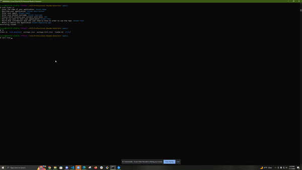

# Readme Generator by Tyler Oates

## Description

* Intent was to enable the user to generate a comprehensive readme via Node. User's are prompted to specific questions and uses that data to generate their readme.

## Begin Program

* node index.js in the command prompt

## Author

* Tyler Oates
* Email: oatesrotc548@gmail.com
* GitHub: https://github.com/Atlas548